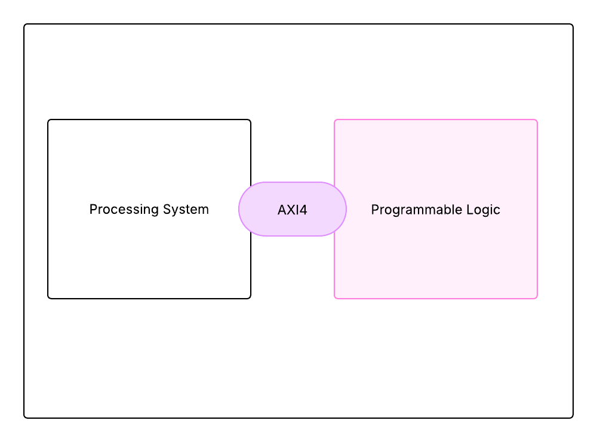
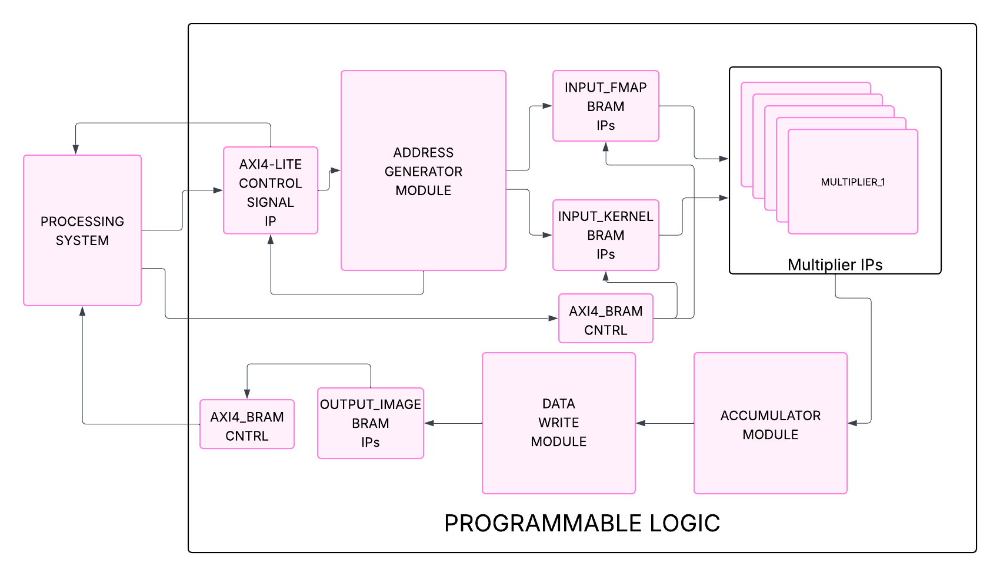
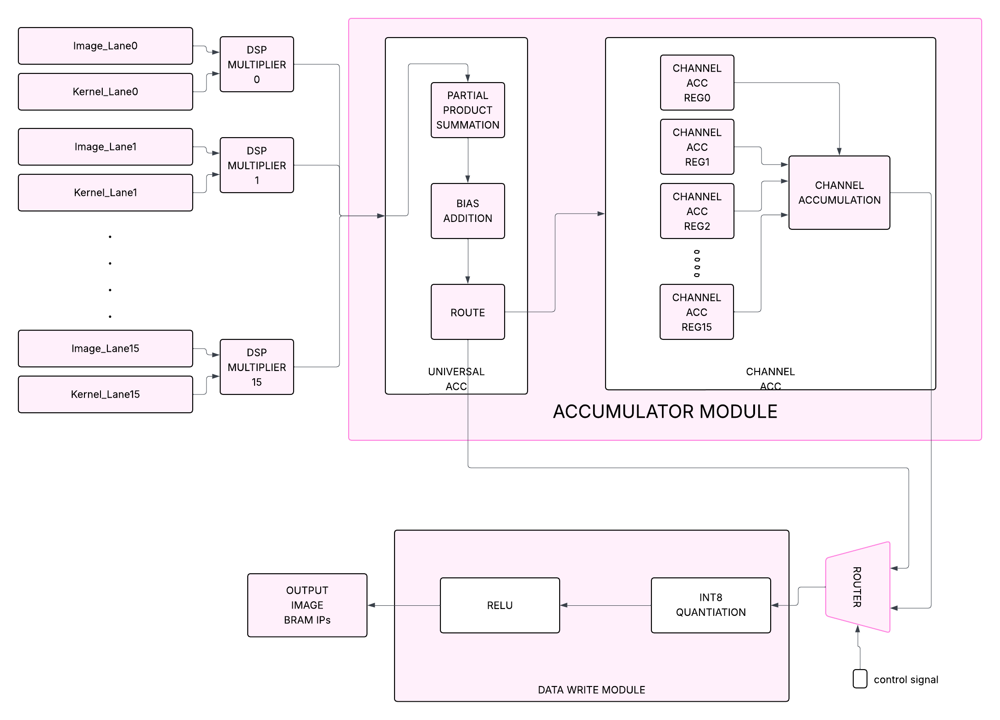
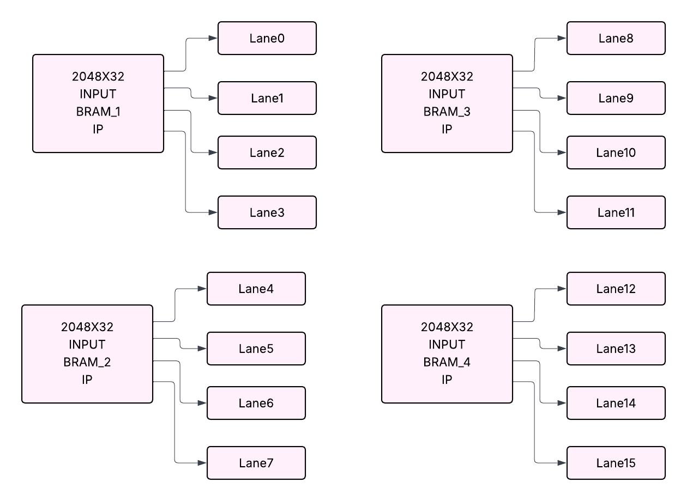

# Reconfigurable FPGA Accelerator for Lightweight CNNs on Edge Devices

---

## 📌 Overview

This project presents a **reconfigurable FPGA-based hardware accelerator** designed to accelerate key operations in lightweight convolutional neural networks (CNNs), targeting real-time inference on edge devices.

The accelerator is optimized for:

* **Low latency**
* **High throughput**
* **Efficient on-chip memory utilization**

The design leverages **INT8 quantization**, **parallel processing**, and **BRAM-based data storage** to enable efficient execution in resource-constrained environments.

---

## 🎯 Objectives

* Accelerate convolution and pooling operations on FPGA
* Enable efficient execution of lightweight CNN models
* Optimize latency and throughput using parallel architecture
* Utilize on-chip memory to minimize external memory access

---

## 🧩 Block Diagrams

This section presents multiple abstraction levels of the system design.

---

### 🔷 1. System-Level Architecture (PS–PL Integration)

<p align="center">
  
</p>

**Description:**

* Shows interaction between **Processing System (PS)** and **Programmable Logic (PL)**
* AXI interfaces used for control and data transfer
* Demonstrates system-level integration

---

### 🔷 2. Core Architecture (PL Design)

<p align="center">
  
</p>

**Description:**

* Shows internal PL components
* BRAM-based memory system
* Compute engine and control modules

---

### 🔷 3. Computation Architecture

<p align="center">
  
</p>

**Description:**

* 16-lane parallel computation
* Multiplier and accumulation flow
* Convolution data path

---

### 🔷 4. Memory Architecture (Lane-Based Design)

<p align="center">
  
</p>

**Description:**

* 32-bit BRAM-based conceptual design
* Parallel memory structure
* Lane-based organization

> ⚠️ Note: The above diagram represents the **initial conceptual design using 32-bit BRAMs**.
> The final implementation uses a **single 128-bit BRAM with CDMA-based data transfer**, replacing multiple 32-bit BRAMs for improved throughput.

---

## 🧠 RTL Architecture (PL)

The programmable logic consists of the following RTL modules:

### 🔹 Control Interface

* AXI4-Lite Control Interface
* Handles configuration and control signals

### 🔹 Address Generation

* Address Generator Module
* Controls memory access patterns for convolution

### 🔹 Memory Subsystem

* Input Feature Map BRAM
* Kernel BRAM
* Output Feature Map BRAM
* AXI BRAM Controllers

### 🔹 Compute Engine

* 16-lane Parallel Multiplier Array
* Accumulator Module

### 🔹 Post-Processing

* ReLU Activation Unit (optional)
* Max Pooling Unit

### 🔹 Data Write Back

* Data Write Module

---

## ⚙️ Memory Architecture

### 🔹 Initial Design (Conceptual)

* BRAM width: 32 bits
* Multiple BRAMs used in parallel
* Limited by MMIO-based transfers

---

### 🔹 Optimized Design (Final Implementation)

The architecture was enhanced using **AXI Central DMA (CDMA)** to improve data throughput.

* **BRAM Width:** 128 bits
* **Memory Depth:** 1024
* **Data Type:** INT8

👉 Each 128-bit word stores:

* **16 INT8 values (16 parallel lanes)**

---

### 🚀 Key Optimization

* Replaced **MMIO-based transfers** with **DMA-based transfers (CDMA)**
* Enabled **direct DDR ↔ BRAM data movement**
* Increased BRAM width from **32-bit → 128-bit**
* Enabled **128-bit burst transfers**

---

### 🧠 Design Impact

| Feature       | Before                | After            |
| ------------- | --------------------- | ---------------- |
| Data Transfer | MMIO (CPU-controlled) | CDMA (DMA-based) |
| BRAM Width    | 32-bit                | 128-bit          |
| BRAM Count    | 4                     | 1                |
| Throughput    | Low                   | High             |
| CPU Overhead  | High                  | Minimal          |

---

### ⚡ Result

* Faster data movement between PS and PL
* Reduced CPU involvement
* Improved overall accelerator throughput

---

## 🚀 Parallel Processing (Lane-Based Design)

The accelerator uses a **16-lane parallel architecture**.

### Data Layout:

```
Depth 0 → [lane15[0], lane14[0], ..., lane0[0]]
Depth 1 → [lane15[1], lane14[1], ..., lane0[1]]
...
```

### Key Advantage:

* Processes **16 channels in parallel**
* Significantly improves throughput

---

## 🔁 Supported Operations

### ✔️ Convolution

* Standard Convolution
* Depthwise Convolution

### ✔️ Kernel Sizes

* 1×1, 2×2, 3×3, 5×5, 7×7

### ✔️ Activation

* Optional ReLU

### ✔️ Pooling

* Max Pooling

---

## 📊 Data Precision

* Input: INT8
* Weights: INT8
* Output: INT8

### Benefits:

* Reduced memory usage
* Increased parallelism
* Efficient edge deployment

---

## 🔗 PS–PL Interaction (AXI Interface)

### 🔹 AXI4-Lite (Control Path)

Used for:

* Configuration
* Start/Stop control
* Status monitoring

Flow:

```
PS → AXI4-Lite → Control Registers → PL
```

---

### 🔹 AXI4 (Data Path via BRAM Controller)

Used for:

* Input data transfer
* Kernel loading
* Output retrieval

Flow:

```
PS ↔ AXI BRAM Controller ↔ BRAM ↔ Compute Engine
```

---

## ⚡ High-Speed Data Transfer using CDMA

To overcome the limitations of MMIO-based transfers, the design integrates **AXI Central DMA (CDMA)**.

### 🔹 Motivation

* MMIO transfers are CPU-driven and slow
* Limits achievable bandwidth

---

### 🔹 Solution

* Enables **direct memory access between DDR and BRAM**

```
DDR (PS) ↔ CDMA ↔ BRAM (PL)
```

---

### 🔹 Benefits

* Eliminates CPU bottleneck
* Supports burst transfers
* Maximizes bandwidth
* Enables wider BRAM design

---

### 🔹 Outcome

* Higher throughput
* Reduced latency
* Better utilization of compute engine

---

## 🔄 Execution Flow

1. **Configuration**

   * PS sets parameters via AXI-Lite

2. **Data Load**

   * Input feature maps → BRAM
   * Kernel weights → BRAM

3. **Execution**

   * Address generator feeds compute engine
   * Convolution + activation + pooling

4. **Write Back**

   * Results stored in BRAM

5. **Read Back**

   * PS retrieves results via AXI/CDMA

---

## 🔁 Reconfigurability

The accelerator supports:

* Kernel size selection
* Convolution type (standard / depthwise)
* ReLU enable/disable
* Parallel lane-based processing

---

## 🛠️ Tools & Technologies

* Verilog / SystemVerilog
* Vivado Design Suite
* FPGA Platforms: Zynq Ultrascale, PYNQ
* AXI Protocol

---

## 📊 Key Highlights

* 16-lane parallel architecture
* 128-bit optimized memory design
* CDMA-based high-speed transfer
* Multi-kernel support (1×1 to 7×7)
* Depthwise + standard convolution
* INT8 optimized inference
* Designed for edge devices

---

## 🚀 Future Work

* Support for additional CNN layers
* Dynamic reconfiguration
* Integration with RISC-V systems
* Scaling to larger CNN models

---

## 🔒 Source Code

The complete implementation is maintained in a private repository.
Selected modules and architectural details are shared here.

---

## 📬 Contact

For further discussion or collaboration, feel free to reach out.
