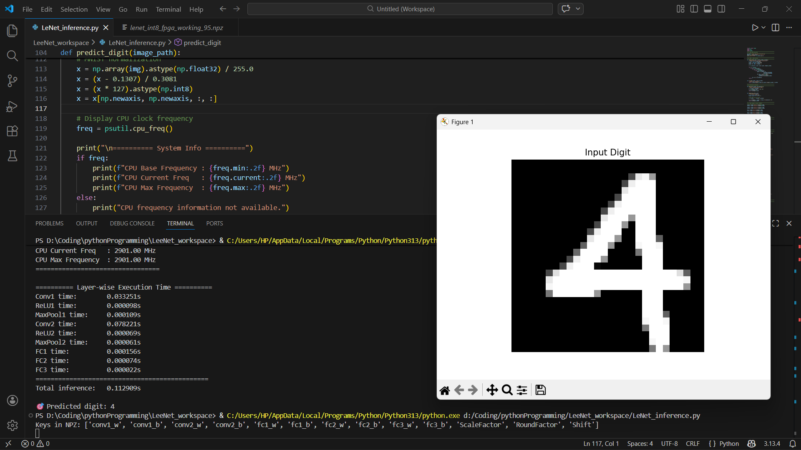
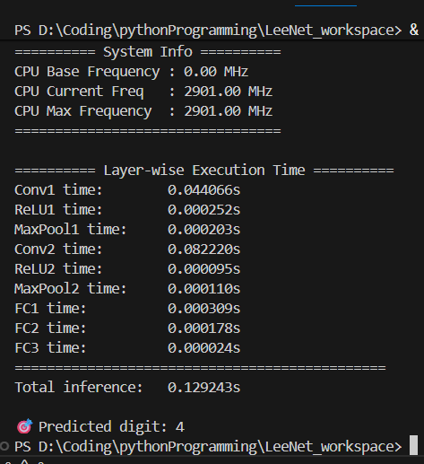

# Reconfigurable FPGA Accelerator for Lightweight CNNs on Edge Devices

---

## 📌 Overview

This project presents a **reconfigurable FPGA-based hardware accelerator** designed to accelerate key operations in lightweight convolutional neural networks (CNNs), targeting real-time inference on edge devices.

The accelerator is optimized for:

* **Low latency**
* **High throughput**
* **Efficient on-chip memory utilization**

The design leverages **INT8 quantization**, **parallel processing**, and **BRAM-based data storage** to enable efficient execution in resource-constrained environments.

---

## 🎯 Objectives

* Accelerate convolution and pooling operations on FPGA
* Enable efficient execution of lightweight CNN models
* Optimize latency and throughput using parallel architecture
* Utilize on-chip memory to minimize external memory access

---

## 🧩 Block Diagrams

This section presents multiple abstraction levels of the system design.

---

### 🔷 1. System-Level Architecture (PS–PL Integration)

<p align="center">
  
</p>

---

### 🔷 2. Core Architecture (PL Design)

<p align="center">
  
</p>

---

### 🔷 3. Computation Architecture

<p align="center">
  
</p>

---

### 🔷 4. Memory Architecture (Lane-Based Design)

<p align="center">
  
</p>

> ⚠️ Note: The above diagram represents the **initial 32-bit BRAM design**.
> The final implementation uses a **single 128-bit BRAM with CDMA-based transfer**, replacing multiple 32-bit BRAMs.

---

## 🧠 RTL Architecture (PL)

* AXI4-Lite Control Interface
* Address Generator
* Input / Kernel / Output BRAM
* AXI BRAM Controllers
* 16-lane Multiplier Array
* Accumulator
* ReLU + Pooling Units
* Data Write Module

---

## ⚙️ Memory Architecture

### 🔹 Initial Design

* 32-bit BRAM
* Multiple BRAMs
* MMIO-based transfer

---

### 🔹 Optimized Design

* **128-bit BRAM**
* **Depth: 1024**
* **INT8 data**

👉 1 word = **16 parallel values**

---

### 🚀 Key Improvements

* MMIO → **CDMA (DMA-based transfer)**
* Direct **DDR ↔ BRAM**
* **128-bit burst transfers**
* Reduced BRAM count (4 → 1)

---

### 🧠 Impact

| Feature  | Before | After   |
| -------- | ------ | ------- |
| Transfer | MMIO   | CDMA    |
| Width    | 32-bit | 128-bit |
| BRAMs    | 4      | 1       |
| CPU Load | High   | Low     |
| Speed    | Low    | High    |

---

## 🚀 Parallel Processing

* 16-lane architecture
* Parallel channel processing

```
Depth 0 → [lane15 ... lane0]
Depth 1 → [lane15 ... lane0]
```

---

## 🔁 Supported Operations

* Standard Convolution
* Depthwise Convolution
* Kernel sizes: 1×1 to 7×7
* ReLU
* Max Pooling

---

## 📊 Data Precision

* INT8 (input, weights, output)

---

## 🔗 PS–PL Interaction

### AXI4-Lite

Control + configuration

```
PS → AXI-Lite → PL
```

### AXI + BRAM

Data movement

```
PS ↔ BRAM ↔ Compute
```

---

## ⚡ High-Speed Data Transfer using CDMA

* Eliminates CPU bottleneck
* Enables burst transfers
* Improves bandwidth

```
DDR ↔ CDMA ↔ BRAM
```

---

## 🔄 Execution Flow

1. Configure via AXI-Lite
2. Load data to BRAM
3. Run computation
4. Store results
5. Read back

---

# 📊 Results & Performance

## ⏱️ Inference Latency

| Platform                         | Method             | Time         |
| -------------------------------- | ------------------ | ------------ |
| CPU (Laptop - i3 13th Gen, 3GHz) | Software Inference | **0.129 s**  |
| FPGA                             | MMIO (No DMA)      | **0.463 ms** |
| FPGA                             | CDMA (DMA)         | **0.041 ms** |

---

### 🚀 Performance Insight

* FPGA (CDMA) is ~**3146× faster than CPU inference**
* FPGA (CDMA) is ~**11× faster than MMIO-based FPGA execution**
* Massive improvement due to:

  * Parallel computation
  * DMA-based data transfer
  * On-chip memory usage

---

## ⚙️ Clock Configuration

* **Frequency:** 125 MHz

---

## 📈 Resource Utilization

* **CLB LUTs:** 17,327
* **Registers:** 25,599
* **BRAM Tiles:** 20
* **URAM:** 16
* **DSPs:** 17

👉 Balanced usage across compute and memory resources

---

## ⏲️ Timing Summary

* **Worst Negative Slack (WNS):** 0.081 ns
* **Worst Hold Slack (WHS):** 0.010 ns
* **Total Negative Slack (TNS):** 0.000 ns

✅ All timing constraints met
✅ No setup/hold violations
✅ Stable at 125 MHz

---

## 🧪 Experimental Results

### 🔹 CPU Inference Output

<p align="center">
  
</p>

---

### 🔹 Layer-wise Timing (Software)

<p align="center">
  
</p>

---

### 🔹 FPGA Accelerator Output

<p align="center">
  
</p>

---

## 🧠 Key Observations

* CDMA removes CPU bottleneck
* 128-bit BRAM improves bandwidth
* Parallel lanes fully utilized
* FPGA significantly outperforms CPU execution
* Design meets timing comfortably

---

## ⚠️ Implementation Note

* The FPGA inference pipeline is currently controlled using **Python (Jupyter Notebook in PYNQ framework)**
* Device drivers and configuration are handled via Python APIs

### 🔹 Optimization Opportunity

* Further performance improvement is possible by:

  * Implementing driver/control in **low-level languages (C/C++)**
  * Reducing software overhead
  * Enabling tighter hardware-software integration

---

## 📊 Key Highlights

* 16-lane parallel architecture
* 128-bit memory system
* CDMA-based transfer
* Multi-kernel support
* INT8 optimized
* Edge-device ready

---

## 🎥 Demo Video

This demo showcases the complete working of the FPGA-based CNN accelerator using **AXI CDMA-based high-speed data transfer**.

---

### 🔹 Accelerator Demo

https://github.com/user-attachments/assets/8310e763-1414-4d1d-b30a-5c4015e775ea

---

### 📌 Demo Description

* A handwritten digit (**digit "4"**) is drawn using **MS Paint**
* Image is sent to FPGA via CDMA
* LeNet model performs inference
* Output is correctly predicted

---

### 🚀 Key Highlights

* Real-time handwritten digit recognition
* Correct classification of digit **"4"**
* Full pipeline demonstration

---

## 🚀 Future Work

* Add more CNN layers
* Dynamic reconfiguration
* RISC-V integration
* Scale to larger models

---

## 📬 Contact

Open for collaboration and discussion
